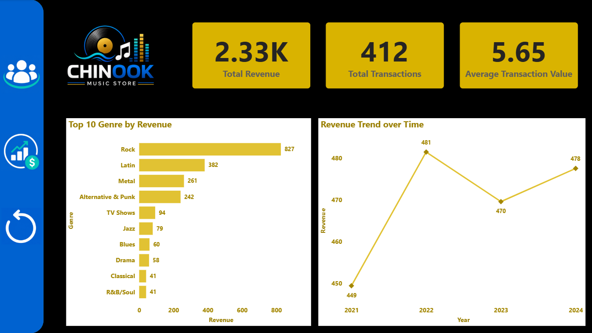
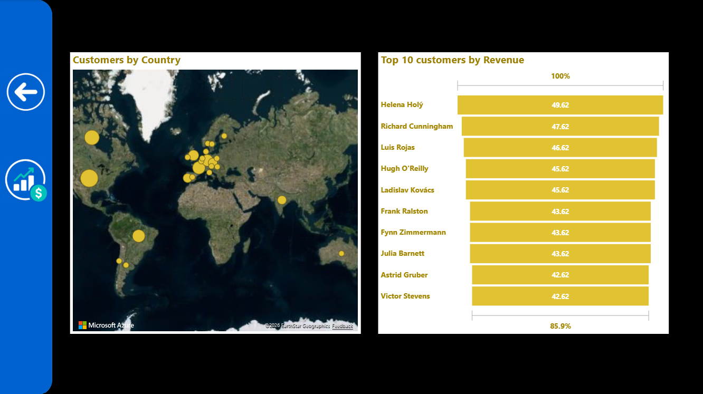
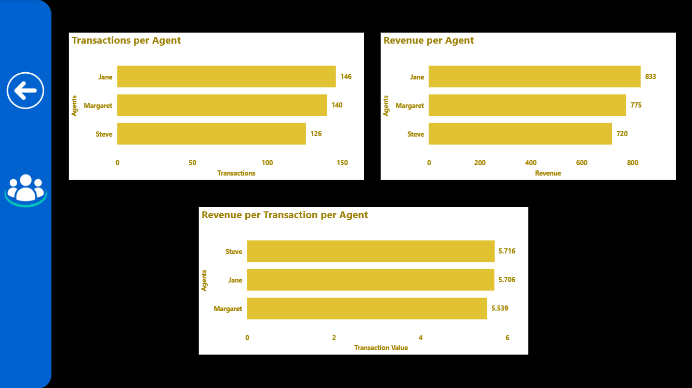

## Chinook-PowerBI Dashboard

### Business Objective
- Which genre generates the most sales revenue and what is the revenue trend over time?
- How are customers distributed over the countries and who are the top customers?
- Which sales agent has handled the most transactions?

### Data Source
MySQL Chinook database, 11 tables, connected live via MySQL connector

### Dashboard Pages

**Revenue Overview**

- This page provides a high-level overview of the Chinook Music Store’s business performance. The KPI cards at the top display key business metrics including Total Revenue (2.33K), Total Transactions (412), and Average Transaction Value (5.65), allowing quick monitoring of overall sales health.
- The Top 10 Genre by Revenue bar chart highlights the best-performing music genres based on revenue contribution. Rock generates the highest revenue, followed by Latin and Metal, indicating strong customer preference towards these genres. Lower-performing genres such as Classical and R&B/Soul contribute comparatively less revenue.
- The Revenue Trend over Time line chart analyzes yearly revenue performance from 2021 to 2024. Revenue increased significantly in 2022, slightly declined in 2023, and recovered again in 2024. This helps identify business growth patterns and yearly sales fluctuations.

**Customer & Geography**

- This page focuses on customer distribution and top customer contribution analysis.
- The Customers by Country map visualizes the global distribution of customers. Most customers are concentrated in North America and Europe, indicating these regions as major business markets. The map helps identify geographical reach and customer concentration.
- The Top 10 Customers by Revenue chart identifies customers contributing the highest revenue to the store. Helena Holý is the top revenue-generating customer, followed closely by Richard Cunningham and Luis Rojas. This visualization helps understand high-value customers.

**Sales Agent Performance**

- This page evaluates the performance of sales agents using transaction and revenue metrics.
- The Transactions per Agent chart compares the number of transactions handled by each sales agent. Jane processed the highest number of transactions, followed by Margaret and Steve.
- The Revenue per Agent chart measures the total revenue generated by each agent. Jane generated the highest revenue overall, showing strong sales performance.
- The Revenue per Transaction per Agent chart analyzes sales efficiency by calculating the average revenue generated per transaction. Steve has the highest revenue per transaction, indicating better value generation per sale despite handling fewer transactions.

### Tools & Techniques
Power BI Desktop, Power BI Service, MySQL connector, DAX measures, navigation buttons, multi-page layout
